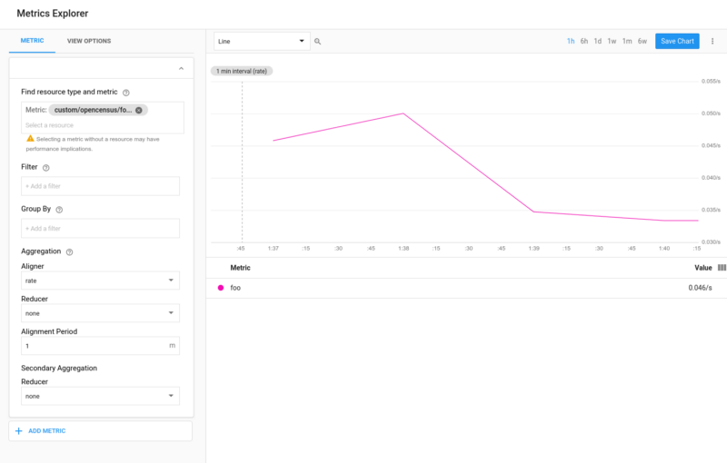
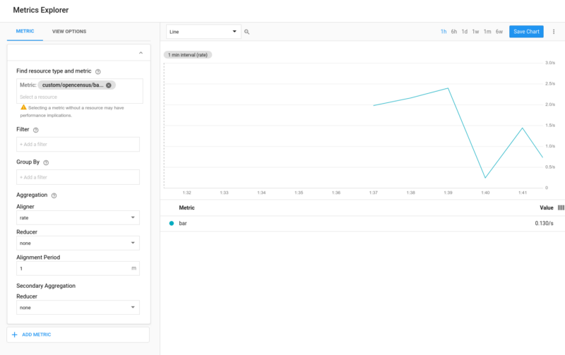

# stats-opencensus-backend

## Motivation

[OpenCensus](opencensus.io) is a compelling project. Customarily, monitoring (and trace) solutions require client applications to use a specific service's proprietary API. Once the client application is written, it's forever bound to a specific monitoring solution. But, that's not what's wanted. OpenCensus decouples metric production from consumption. You write monitoring (and trace) code once and then -- at production time !! -- your DevOps or SRE folks use whichever monitoring system they prefer.

[Statsd](https://github.com/etsy/statsd) is a compelling project. It is a widely used mechanism for the lightweight (udp not tcp) shipping of metrics (counters, gauges and timers). The project currently supports multiple [backends](https://github.com/etsy/statsd/blob/master/docs/backend.md) too but it did not support OpenCensus.

Stats+Opencensus means that *any* application currently shipping metrics using statsd can now be monitored (in principle) by any monitoring solution supported by Opencensus (by Node.JS... unfortunately, these remain langauge-dependent). Ironically, OpenCensus only supports Stackdriver and Prometheus (in Node.JS) today *but*, as more systems are added (as they will be), these will become immediately available to statsd applications.

## Write-up

[here](https://medium.com/google-cloud/statsd-opencensus-backend-33297c6a58b5)

## Clone
- [etsy/statsd](https://github.com/etsy/statsd)
- [statsd-opencensus-backend](https://github.com/DazWilkin/statsd-opencensus-backend/blob/master/README.md)


## Enable Stackdriver

### Create GCP Project (`[[YOUR-PROJECT]]`) *and* enable billing

As I learned, if you miss the "enable billing" step, you will not receive metrics data in Stackdriver

### Create Stackdriver Workspace

### Create service account

w/ Stackdriver permissions (`roles/monitoring.metricWriter`) and download the key

From within the etsy statsd directory:

```bash
EXPORT GOOGLE_APPLICATION_CREDENTIALS = ${PWD}/key.json
````

config.js
```json
{
    flushInterval: 5000,
    backends: [
        "[[PATH-TO]]/statsd-opencensus-backend"
    ],
    opencensus:{
        stackdriver: {
            projectId: [[YOUR-PROJECT]]
        }
    }
}
```

## Enable Prometheus

Currently prometheus is enabled by default and exports on ::9464

```
# HELP statsd_bad_lines_seen None provided
# TYPE statsd_bad_lines_seen counter
statsd_bad_lines_seen{status="OK"} 40

# HELP statsd_packets_received None provided
# TYPE statsd_packets_received counter
statsd_packets_received{status="OK"} 40

# HELP statsd_metrics_received None provided
# TYPE statsd_metrics_received counter
statsd_metrics_received{status="OK"} 40

# HELP foo None provided
# TYPE foo counter
foo{status="OK"} 40

# HELP bar None provided
# TYPE bar gauge
bar{status="OK"} 1949.1418679999997

# HELP statsd_timestamp_lag None provided
# TYPE statsd_timestamp_lag gauge
statsd_timestamp_lag{status="OK"} 38
```

config.js
```json
{
    flushInterval: 5000,
    backends: [
        "[[PATH-TO]]/statsd-opencensus-backend"
    ],
    opencensus:{
        promethues: {
            port: [[YOUR-PORT]]
        }
    }
}
```

## Run statsd

Then run it:
```bash
node stats.js /path/to/yourConfig.js

```

## Test

Test it by publishing a counter:
```
echo "foo:1|c" | nc -u -w0 127.0.0.1 8125
```
...or many:
```bash
while true
do
  COUNTER="foo:1|c"
  echo ${COUNTER}
  echo ${COUNTER} |  nc -u -w0 127.0.0.1 8125
  sleep 1s
done
```
Observe counters created in Stackdriver either through the console or APIs Explorer (more to come)

Test it by pushing a gauge:
```
echo "bar:3.14159|g" | nc -u -w0 127.0.0.1 8125
```
...or many:
```bash
while true
do
  GAUGE="bar:$(awk -v min=0 -v max=99 'BEGIN{srand(); print min+rand()*(max-min+1)}')|g"
  echo ${GAUGE}
  echo ${GAUGE} |  nc -u -w0 127.0.0.1 8125
  sleep 1s
done
```


## Stackdriver



